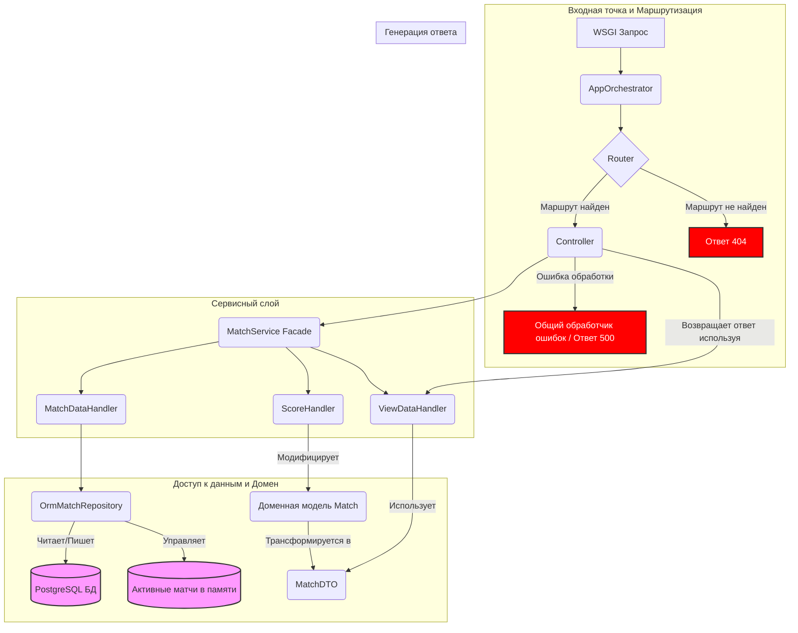

# Анализ архитектуры приложения Tennis Score

Дата анализа: 02.06.2025

## Введение

Этот документ представляет собой анализ архитектуры приложения для подсчета очков в теннисе. Цель анализа — выявить потенциальные проблемы, узкие места и предложить возможные пути улучшения.

## Общая архитектура приложения

Приложение построено на принципах WSGI и имеет многоуровневую структуру, включающую:

*   **Точка входа и оркестрация**: [`app.py`](src/tennis_score/app.py:1) и [`AppOrchestrator`](src/tennis_score/core/app_orchestrator.py:14) отвечают за инициализацию приложения, настройку middleware (CORS, Logging, Static files) и базовую обработку WSGI-запросов.
*   **Маршрутизация**: [`router.py`](src/tennis_score/core/router.py:1) определяет соответствие URL-путей и HTTP-методов функциям-контроллерам с помощью статической таблицы маршрутизации.
*   **Контроллеры**: Расположены в `src/tennis_score/controllers/` и отвечают за прием запросов, извлечение параметров и вызов сервисного слоя.
*   **Сервисный слой (фасад и обработчики)**: [`MatchService`](src/tennis_score/services/match_service.py:12) выступает как фасад, координирующий работу более специализированных обработчиков:
    *   [`MatchDataHandler`](src/tennis_score/services/match_data_handler.py:8): Управление данными матчей (создание, получение).
    *   [`ScoreHandler`](src/tennis_score/services/score_handler.py:10): Инкапсуляция правил подсчета очков и определения победителей.
    *   [`ViewDataHandler`](src/tennis_score/core/presentation.py:5): Подготовка данных для отображения.
*   **Репозиторий**: [`OrmMatchRepository`](src/tennis_score/repositories/orm_repository.py:18) отвечает за взаимодействие с базой данных PostgreSQL с использованием SQLAlchemy. Он управляет как активными матчами (хранящимися в памяти), так и завершенными (хранящимися в БД).
*   **Модели**:
    *   Доменная модель [`Match`](src/tennis_score/model/match.py:7): Представляет теннисный матч со всем его состоянием и некоторым поведением.
    *   ORM-модели ([`MatchORM`](src/tennis_score/model/orm_models.py), [`PlayerORM`](src/tennis_score/model/orm_models.py)): Используются SQLAlchemy для отображения данных в базу.
    *   DTO ([`MatchDTO`](src/tennis_score/dto/match_dto.py)): Используется для передачи данных между слоями и для вывода.

## Диаграмма компонентов (упрощенная)

## Выявленные архитектурные проблемы и области для улучшения

1.  **Смешанное хранение состояния матчей (в памяти и БД):**
    *   **Проблема**: Активные матчи хранятся в словаре `_active_matches` в [`OrmMatchRepository`](src/tennis_score/repositories/orm_repository.py:31), а завершенные – в БД. Это усложняет логику получения полного списка матчей (см. [`list_matches_paginated`](src/tennis_score/repositories/orm_repository.py:85)), может привести к потере данных активных матчей при перезапуске или сбое приложения, и ограничивает горизонтальное масштабирование (состояние привязано к одному экземпляру приложения).
    *   **Предложение**: Рассмотреть возможность хранения всех матчей (и активных, и завершенных) в базе данных. Активные матчи могут иметь специальный статус. Это упростит запросы, улучшит консистентность данных и масштабируемость. Для часто обновляемых активных матчей можно использовать кэширование (например, Redis) для снижения нагрузки на основную БД.

2.  **"Размытые" границы ответственности в сервисном слое:**
    *   **Проблема**: [`MatchService`](src/tennis_score/services/match_service.py:12) заявлен как фасад "без бизнес-логики", но его метод [`update_match_score`](src/tennis_score/services/match_service.py:29) содержит значительную часть координирующей и даже бизнес-логики (например, получение/создание ID игроков, решение о сохранении завершенного матча). Также, подготовка данных для отображения завершенных матчей ([`prepare_completed_match_view_data`](src/tennis_score/services/match_service.py:112)) находится в `MatchService`, а не в [`ViewDataHandler`](src/tennis_score/core/presentation.py:5), что неконсистентно.
    *   **Предложение**: Перенести больше логики из [`update_match_score`](src/tennis_score/services/match_service.py:29) в соответствующие обработчики или создать новые, более гранулярные сервисы/обработчики. Перенести всю логику подготовки данных для отображения в [`ViewDataHandler`](src/tennis_score/core/presentation.py:5).

3.  **Создание зависимостей в конструкторах (отсутствие Dependency Injection):**
    *   **Проблема**: Классы, такие как [`MatchService`](src/tennis_score/services/match_service.py:14) и [`OrmMatchRepository`](src/tennis_score/repositories/orm_repository.py:20), сами создают экземпляры своих зависимостей. Это затрудняет модульное тестирование (требуется monkey-patching) и делает систему менее гибкой.
    *   **Предложение**: Внедрить механизм Dependency Injection. Зависимости должны передаваться в конструкторы классов извне. Это можно сделать вручную или с помощью DI-контейнера.

4.  **Связь доменной модели с представлением и DTO:**
    *   **Проблема**: Доменная модель [`Match`](src/tennis_score/model/match.py:7) содержит методы для форматирования счета ([`_format_points`](src/tennis_score/model/match.py:61), [`get_final_score_str`](src/tennis_score/model/match.py:91)) и преобразования в DTO ([`to_live_dto`](src/tennis_score/model/match.py:114), [`to_final_dto`](src/tennis_score/model/match.py:138)). Это нарушает принцип независимости доменной модели от деталей представления и передачи данных.
    *   **Предложение**: Вынести логику форматирования и преобразования в DTO из доменной модели. Преобразование в DTO может происходить в сервисном слое или специальном слое адаптеров/презентеров. Форматирование для отображения – задача [`ViewDataHandler`](src/tennis_score/core/presentation.py:5) или самого шаблонизатора.

5.  **Жестко закодированная таблица маршрутизации и ограниченные возможности роутера:**
    *   **Проблема**: Статическая таблица [`ROUTING_TABLE`](src/tennis_score/core/router.py:58) может стать громоздкой. Роутер не поддерживает переменные в путях (например, `/matches/{match_id}`).
    *   **Предложение**: Рассмотреть использование более гибкого механизма маршрутизации, возможно, с использованием декораторов или более продвинутой библиотеки маршрутизации, которая поддерживает переменные в путях и другие возможности.

6.  **Обработка параметров и валидация в контроллерах:**
    *   **Проблема**: Извлечение и базовая валидация параметров запроса разбросаны по контроллерам.
    *   **Предложение**: Централизовать валидацию параметров с помощью схем (например, Pydantic). Это сделает контроллеры "тоньше" и уменьшит дублирование кода.

7.  **Неконсистентность возвращаемых типов из репозитория:**
    *   **Проблема**: [`OrmMatchRepository`](src/tennis_score/repositories/orm_repository.py:18) возвращает то объекты [`MatchDTO`](src/tennis_score/dto/match_dto.py:10), то словари.
    *   **Предложение**: Стандартизировать возвращаемые типы. Предпочтительно всегда возвращать DTO или доменные объекты, если это уместно для слоя репозитория.

8.  **Глобальный экземпляр `MatchService` в контроллерах:**
    *   **Проблема**: В [`match_controllers.py`](src/tennis_score/controllers/match_controllers.py:9) создается единый экземпляр `match_service`. Если сервис станет stateful, это приведет к проблемам.
    *   **Предложение**: В сочетании с DI, экземпляры сервисов должны создаваться на запрос или в рамках определенного скоупа.

## План дальнейших действий

1.  **Обсуждение выявленных проблем**: Обсудить эти пункты для подтверждения их актуальности и приоритетности.
2.  **Детализация решений**: Для выбранных проблем разработать более детальные планы по их устранению.
3.  **Реализация**: После утверждения плана, можно будет перейти к реализации изменений.