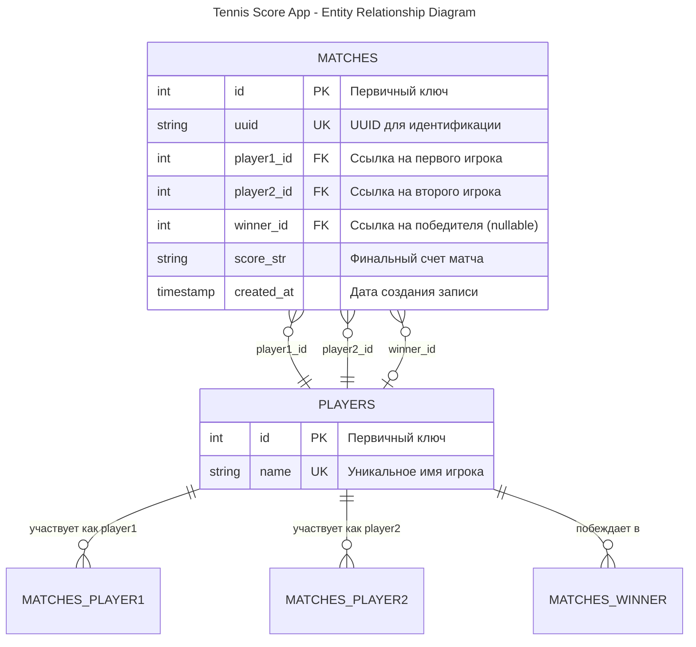
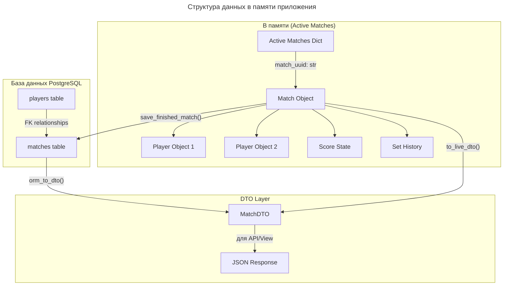

# Tennis Score App - Архитектура базы данных

## ER Диаграмма базы данных

## Детальное описание сущностей

### Таблица PLAYERS (Игроки)
- **id** (INTEGER, PRIMARY KEY) - Уникальный идентификатор игрока
- **name** (VARCHAR, UNIQUE, NOT NULL) - Имя игрока (должно быть уникальным)

### Таблица MATCHES (Матчи)
- **id** (INTEGER, PRIMARY KEY) - Уникальный идентификатор матча в БД
- **uuid** (VARCHAR, UNIQUE, NOT NULL) - UUID для активных матчей (используется для поиска)
- **player1_id** (INTEGER, FOREIGN KEY → players.id, NOT NULL) - Первый игрок
- **player2_id** (INTEGER, FOREIGN KEY → players.id, NOT NULL) - Второй игрок
- **winner_id** (INTEGER, FOREIGN KEY → players.id, NULLABLE) - Победитель матча
- **score_str** (VARCHAR, NOT NULL) - Финальный счет в строковом формате
- **created_at** (TIMESTAMP) - Время создания записи

## Архитектура данных в памяти

## Потоки данных

### 1. Создание нового матча
1. **MatchService.create_match()** → создает объект Match в памяти
2. **OrmMatchRepository._active_matches[uuid]** → сохраняет в словаре активных матчей
3. Игроки НЕ создаются в БД до завершения матча

### 2. Завершение матча
1. **OrmMatchRepository.save_finished_match()** → сохраняет матч в БД
2. **get_or_create_player_by_name()** → создает/находит игроков в БД
3. Создается запись в таблице **matches**
4. Матч удаляется из **_active_matches**

### 3. Получение данных
- **Активные матчи**: из _active_matches → Match.to_live_dto() → MatchDTO
- **Завершенные матчи**: из БД → orm_to_dto() → MatchDTO
- **Список матчей**: комбинация активных + завершенных с пагинацией

## Ограничения целостности

1. **UNIQUE** constraint на `players.name` - имена игроков уникальны
2. **UNIQUE** constraint на `matches.uuid` - UUID матчей уникальны  
3. **FOREIGN KEY** constraints для связей с таблицей players
4. **NOT NULL** constraints для обязательных полей
5. **CHECK** constraint: player1_id ≠ player2_id (на уровне приложения)

## Индексы для производительности

Рекомендуемые индексы:
- `CREATE INDEX idx_matches_uuid ON matches(uuid);`
- `CREATE INDEX idx_matches_player1 ON matches(player1_id);`
- `CREATE INDEX idx_matches_player2 ON matches(player2_id);`
- `CREATE INDEX idx_matches_winner ON matches(winner_id);`
- `CREATE INDEX idx_players_name ON players(name);`
