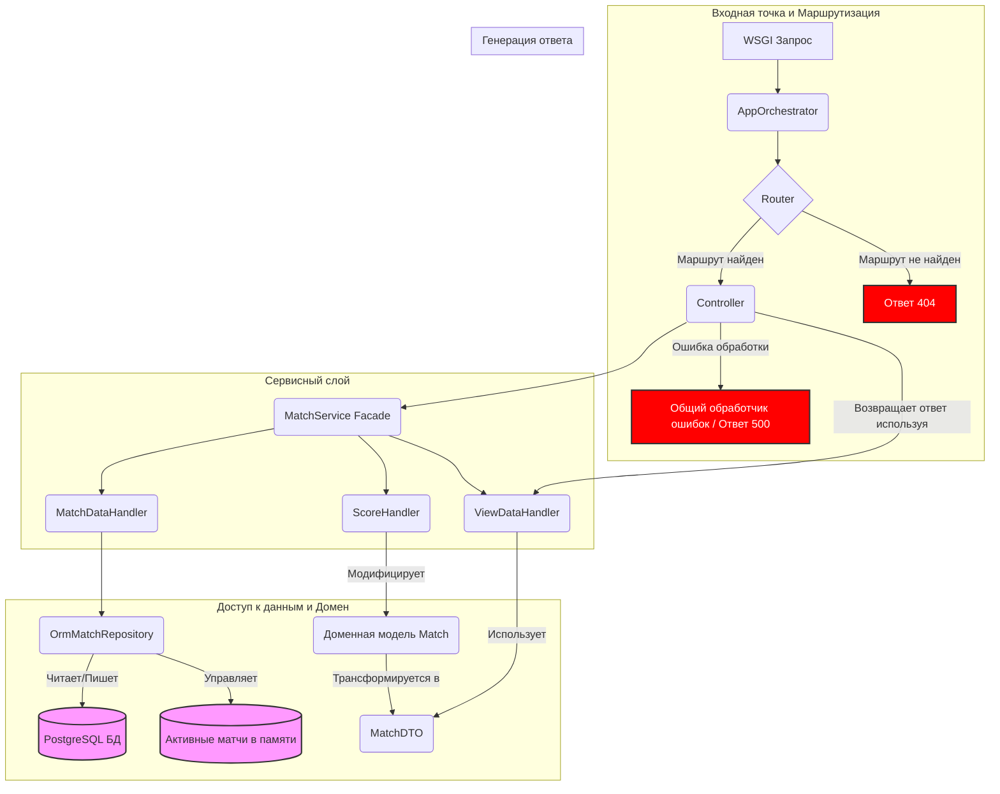

```mermaid
%% Request Handling Flow for Tennis Score Application
graph TD
    %% --- Entry Point & Routing ---
    subgraph "Входная точка и Маршрутизация"
        direction LR
        A[WSGI Запрос] --> B(AppOrchestrator)
        B --> C{Router}
        C -- Маршрут найден --> D(Controller)
        C -- Маршрут не найден --> E[Ответ 404]
        D -- Ошибка обработки --> ER[Общий обработчик ошибок / Ответ 500]
    end

    %% --- Service Layer ---
    subgraph "Сервисный слой"
        direction LR
        D --> F(MatchService Facade)
        F --> G(ScoreHandler)
        F --> H(MatchDataHandler)
        F --> I(ViewDataHandler)
    end

    %% --- Data Access & Domain ---
    subgraph "Доступ к данным и Домен"
        direction LR
        H --> J(OrmMatchRepository)
        G -- Модифицирует --> K(Доменная модель Match)
        J -- Читает/Пишет --> L[(PostgreSQL БД)]
        J -- Управляет --> M[(Активные матчи в памяти)]
        K -- Трансформируется в --> N(MatchDTO)
        I -- Использует --> N
    end

    %% --- Response Generation ---
    subgraph "Генерация ответа"
        direction LR
        D -- Возвращает ответ используя --> I
    end

    %% --- Styling (Optional, for better visual distinction) ---
    classDef database fill:#f9f,stroke:#333,stroke-width:2px;
    classDef error fill:#f00,stroke:#333,stroke-width:2px,color:#fff;
    class L,M database;
    class E,ER error;
```
